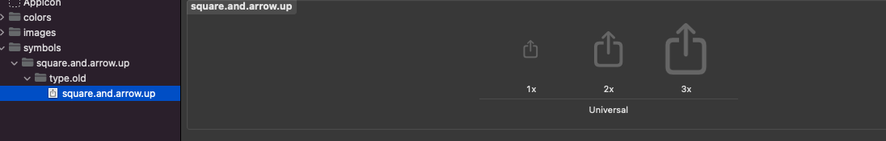
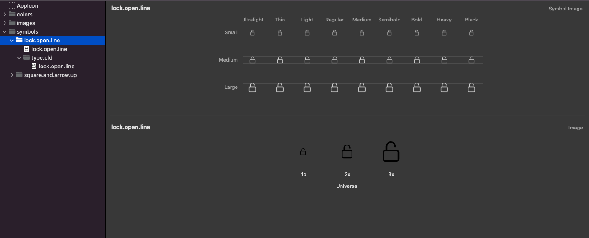

# AppSymbol
You can use the *SFSymbol* in your ios 13 below deployment target projects without any version check.
<br>

## Why App Symbol?
SFSymbol is only available above the iOS 13, So we have to check the iOS version every time we use SFSymbol in the project.  We can get rid of this boilerplate code using the AppSymbol framework.

<br>

## How to Use

- **SFSymbol**
    
    1. Add symbol image files to assert folder with original SFSymbol name for older iOS versions.

    <br>

    

    2. Extend the `AppSymbolNames` to add type `AppSymbolNameType` variable with any name. And add variable value as original SFSymbol name. 

    <br>

    ```Swift
    extension AppSymbolNames {

        var squareAndArrowUp: AppSymbolNameType { .init(rawValue: "square.and.arrow.up") }

    }
    ```

    3. Finally, you can use this symbol file using the function provided by the framework.

    ```Swift
    let shareButton = UIButton.init(with: .squareAndArrowUp, to: .systemFont(ofSize: 17, weight: .medium), for: .normal, scale: .medium)

    let shareImageView = UIImageView.init(.squareAndArrowUp, .systemFont(ofSize: 15, weight: .medium), scale: .medium)
    ```

    4. Result
        - iOS 15.2 device

         

        - iOS 12.0 device

        

- **Custom Symbol**

    1. Create custom symbol using template and symbol image files to older iOS versions. (*You can find how to create custom symbol using template [here](https://developer.apple.com/documentation/uikit/uiimage/creating_custom_symbol_images_for_your_app).*)

    <br>

    

    2. Extend the `AppSymbolNames` to add type `AppSymbolNameType` variable with any name. And add variable value as original SFSymbol name. 

    <br>

    ```Swift
    extension AppSymbolNames {  
        ...

        static var lockOpenLine: AppSymbolNameType { .init(rawValue: "lock.open.line") }

    }
    ```

    3. Finally, you can use this symbol file using the function provided by the framework.

    ```Swift
    let shareButton = UIButton.init(with: .lockOpenLine, to: .systemFont(ofSize: 17, weight: .medium), for: .normal, scale: .medium)

    let shareImageView = UIImageView.init(.lockOpenLine, .systemFont(ofSize: 15, weight: .medium), scale: .medium)
    ```
    4. Result
        - iOS 15.2 device

         

        - iOS 12.0 device

        

<br><br>

You can find the original sample code [here](../../Example/MNkSupportUtilities/AppSymbol_comp.swift).

---
