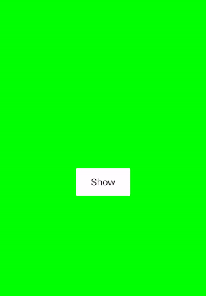

# MNkAlertView
If you want to create a custom alert view precisely of the design handoff, you can get help from the MNKAlertView framework.
<br>

### **Show Simple Alert**


You can build this simple alert view comes with the library by runnig below code.

```Swift 
func showAlert() {
        let alertView = MNkAlertView()
        alertView.titleLabel.text = "Confirm"
        alertView.messageLabel.text = "Do you want to proceed with these settings?"
        alertView.type = .multi
        
        let alertController = MNkAlertViewController()
        alertController.set(alertView: alertView)
        self.showAlert(of: alertController, aditional: nil)
}
```

### **Build More Customized Alert**
If your UI design element doesn't match with the UI element that comes with the library, you can create any custom alert view by subclassing the `MNkAlertView` class. 



- Create `CustomAlertView` view by subclassing the `MNkAlertView`.

```Swift
class CustomAlertView: MNkAlertView {
    private var topStripView: UIView 
    private var indicatorImageView: UIImageView 
    
    override func createViews() {
        super.createViews()
        
        mainStackView.insertArrangedSubview(indicatorImageView, at: 0)
        mainStackView.spacing = 20
        
        rightActionButton.layer.cornerRadius = 3
        rightActionButton.backgroundColor = .lightBlue
        rightActionButton.setTitleColor(.white, for: .normal)
    }
    
    override func insertAndLayoutSubviews() {
        self.addSubview(alertContainer)
        alertContainer.addSubview(mainStackView)

        ......
    }
    
    override func config() {
        backgroundColor = .clear
    }
}
```
- And call `showAlert(of:_, aditional: _)` function with the `CustomAlertView`.

```Swift 
func showCustomAlert() {
    let alertView = CustomAlertView()
    alertView.titleLabel.text = "Saved"
    alertView.messageLabel.text = "New settings save successfully."
        
    let alertController = MNkAlertViewController()
    alertController.set(alertView: alertView)
    self.showAlert(of: alertController, aditional: nil)
}
```

- You can catch button action by assign clouser type to `action` variable.

```Swift 
alertView.action = { actionType, data in
            switch actionType {
            case .rightClick:
                print("Right Action")
                
            case .leftClick:
                print("Left Action")
                
            default:
                break
            }
        }
```
<br><br>

You can find the original sample code [here](../../Example/MNkSupportUtilities/MNkAlertView_comp.swift).

---

